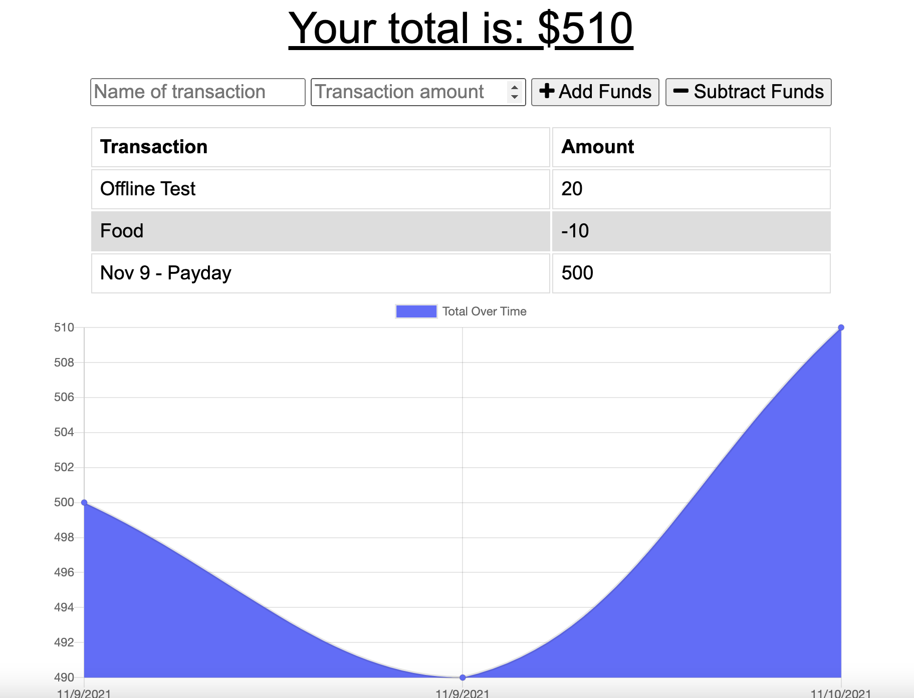

# Budget Tracker

## Budget Tracker Description

This application is designed to assist busy people in keeping track of their budget through the use of MongoDB and PWA. Through the use of PWA, user's can update their budget online and offline. Recommended application to use is Heroku. Future development will prioritize a reduction in console log errors.

## Using application

To use this application, visit the deployed application: https://pure-anchorage-16941.herokuapp.com/

## Installing application

To install this application for development, either clone this repository or download directly through a zip file. Ensure you're running it on VS-Code. Make sure to use npm to install all necessary packages (morgan, mongodb, express). Start through using the "npm start".